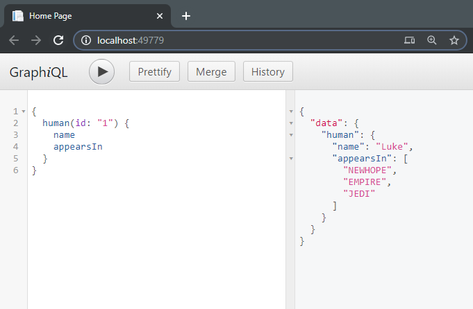

This repo contains a hello word angular application that connects to a GraphQL .NET backend

# How to set this up?
Navigate to a local folder where you hold your repos and clone this repo 

```bash
git clone https://github.com/jstoppa/graphql
cd graphql
```

Once you've cloned the repo, you'll see two folders:
- backend 
- frontend

# Running the backend
- Navigate to the folder ```backend/WebApi``` and open the file ```Example.sln``` in Visual Studio
- Start the solution (you might need to set the WebApi project as Startup Project)
- Navigate to the website http://localhost:49779 and you should see the GraphQL playground as shown below in the screenshot

<p align="center"></a></p>

# Running the frontend 
- Open the ```frontend``` folder in Visual Studio Code
- Run ```npm install```
- Run ```npm start```
